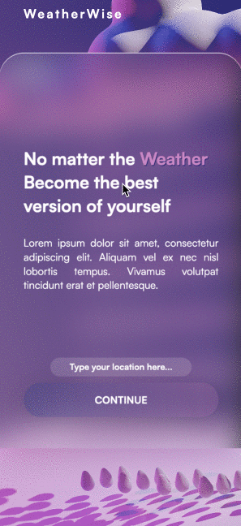

# 🌦 WeatherWise 🌦

<div align="center">

  [](https://wakatime.com/badge/github/tomas-trls/geoloc-frontend-project)
</div>

The aim of this Project was to create a weather Api app that returns to the user the weather data in his area. He can also search for other locations. WeatherWise is a web application that fetches the weather forecast data and other details from the <a href="https://www.weatherapi.com/">Weather API</a>. The app features a main page with a searchBar where the user is prompted to write a location. This then directes him to the dashboard where he can see the weather in that area but also plan his day by writing a TODO list.

## ⚙️ Features

- Search for Location weather using SearchBar
- Get Current Area Geolocation
- Todo List
- Display the weather for the day but also the forecast of the next 7 days.
- Creative Design
- Fully responsive design

## 🦦 Demo

<div align="center">
<a  href="https://tomas-trls.github.io/geoloc-frontend-project">[Live Demo]</a>
</div>


<div align="center">

  ### 🖥️ <ins>Desktop</ins>
  


  ### 📱 <ins>Mobile</ins>

  
</div>
  
## 🛠️ Installation

To run the app locally, please follow these steps:

- Clone the repository to your local machine.
- Install the necessary dependencies using npm install.
- Get your own API key in the <a href="https://www.weatherapi.com/">Weather API site</a>.
- Create and update the ```.env``` file with ```VITE_WEATHER_API_KEY="YOUR_API_KEY"```
- Start the server using npm run dev.
- Open http://localhost:5173/geoloc-frontend-project/ in your web browser.

## 📚 Usage

To use the app, simply navigate to the Home page and begin searching a location. You will then be sent to the dashboard. 
To go back to the Home page, simply click on the logo.

## 🧑‍💻 Author

<strong>[@tomas-trls](https://www.github.com/tomas-trls) / tomast25@hotmail.com </strong>
